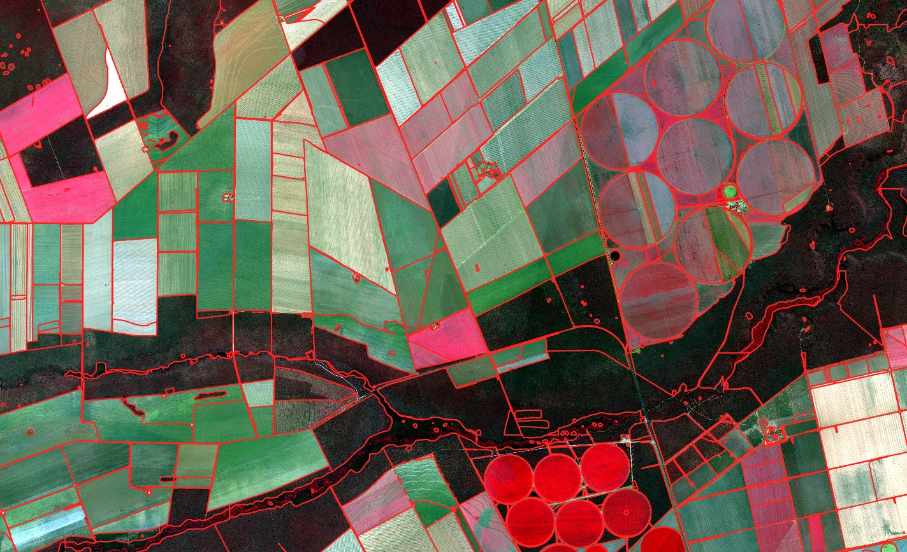
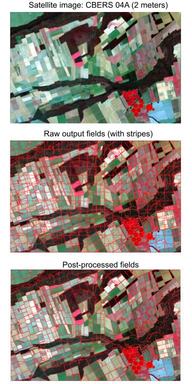

# Field Boundary Detection



## Create virtualenv

```shell
$ python3 -m venv env
$ source env/bin/activate
```

## Install requirements

```shell
$ pip3 install -r requirements.txt
```

## Install SAM

```shell
$ pip3 install git+https://github.com/facebookresearch/segment-anything.git
```

## Install GDAL

```shell
$ sudo apt-get update
$ sudo apt-get install libgdal-dev python3-dev gdal-bin python3-gdal gcc g++
$ pip3 install GDAL==$(gdal-config --version) --global-option=build_ext --global-option="-I/usr/include/gdal"
```

## Download SAM

```shell

wget https://dl.fbaipublicfiles.com/segment_anything/sam_vit_h_4b8939.pth

wget https://dl.fbaipublicfiles.com/segment_anything/sam_vit_l_0b3195.pth

wget https://dl.fbaipublicfiles.com/segment_anything/sam_vit_b_01ec64.pth
```

## Download example image

https://drive.google.com/file/d/1iZGxn-E155bzZCBhcKcQhUDxOZk-Z-tr/view?usp=sharing

## Execute main.py

```shell
python3 main.py
```

## Methodology

